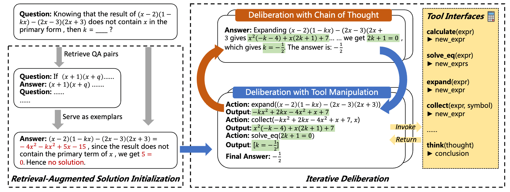
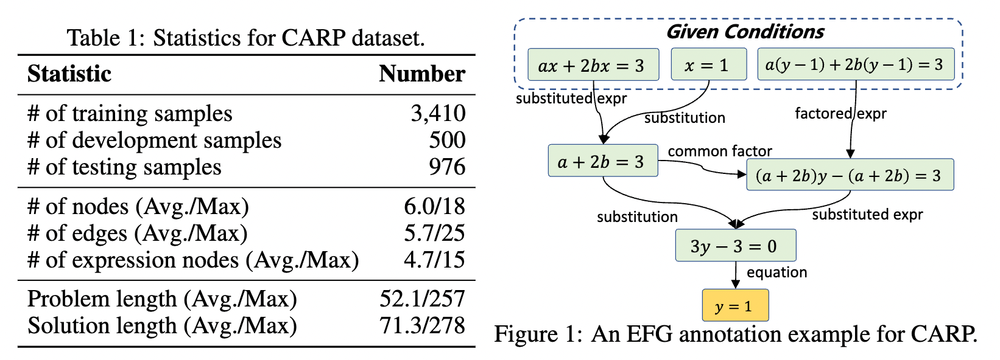
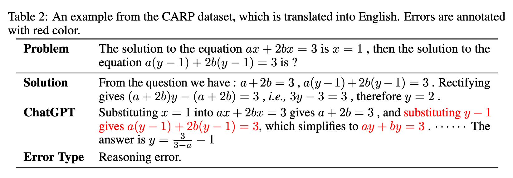

# CARP
This repo provides the CARP dataset and the source code of our paper: [Evaluating and Improving Tool-Augmented Computation-Intensive Math Reasoning](https://arxiv.org/abs/2306.02408).

## Introduction
We construct CARP, a new Chinese dataset consisting of 4,886 computation-intensive algebra problems with formulated annotations on intermediate steps.
Furthermore, we propose a new approach that can deliberate the reasoning steps with tool interfaces, namely DELI.


## The CARP Dataset
The **CARP** dataset consists of 4,886 middle school computation-intensive algebra problems, and each problem is associated with a natural language solution and an annotated EFG.
Our annotated EFG explicitly depicts the step-by-step reasoning process of a math problem in a readable and concise format.




The CARP dataset and other datasets evaluated in the paper are stored in [`data`](https://github.com/RUCAIBox/CARP/blob/main/data) directory. 

## Quick Start
### Setup
1. Install dependencies.
```
conda create --name carp python=3.9
conda activate carp
pip install -r requirements.txt
```
2. Create a file `./openai_api_key` and put your OpenAI API keys in it.

### Run
#### CARP
```bash
# Random CoT
bash scripts/carp/random_cot.sh
# Retrieval CoT
bash scripts/carp/retrieval_cot.sh
# DELI
bash scripts/carp/deli.sh
```

#### MATH
```bash
DATA_NAME="algebra" # prealgebra / number_theory / counting_and_probability

# Random CoT
bash scripts/MATH/random_cot-general.sh $DATA_NAME
# Retrieval CoT
bash scripts/MATH/retrieval_cot-genral.sh $DATA_NAME
# DELI
bash scripts/MATH/deli-general.sh $DATA_NAME
```

#### AGIEval
```bash
# Gaokao-MathCloze
# Random-CoT
bash scripts/agieval/gaokao-mathcloze/random_cot.sh
# DELI
bash scripts/agieval/gaokao-mathcloze/deli.sh

# SAT-Math
# Random-CoT
bash scripts/agieval/sat-math/random_cot.sh
# DELI
bash scripts/agieval/sat-math/deli.sh
```

## License
The CARP datasets in `data/carp` and `data/carp_en` are under a [Creative Commons Attribution-NonCommercial-ShareAlike 4.0 International License][cc-by-nc-sa].

[![CC BY-NC-SA 4.0][cc-by-nc-sa-image]][cc-by-nc-sa]

[cc-by-nc-sa]: http://creativecommons.org/licenses/by-nc-sa/4.0/
[cc-by-nc-sa-image]: https://licensebuttons.net/l/by-nc-sa/4.0/88x31.png
[cc-by-nc-sa-shield]: https://img.shields.io/badge/License-CC%20BY--NC--SA%204.0-lightgrey.svg

## Citation
Please consider citing our work if you find it useful.
```bibtex
@article{zhang2023evaluating,
  title={Evaluating and Improving Tool-Augmented Computation-Intensive Math Reasoning},
  author={Zhang, Beichen and Zhou, Kun and Wei, Xilin and Zhao, Wayne Xin and Sha, Jing and Wang, Shijin and Wen, Ji-Rong},
  journal={arXiv preprint arXiv:2306.02408},
  year={2023}
}
```

## Reference
We refer to the following repos:
* https://github.com/reasoning-machines/pal
* https://github.com/FranxYao/chain-of-thought-hub
* https://github.com/microsoft/AGIEval